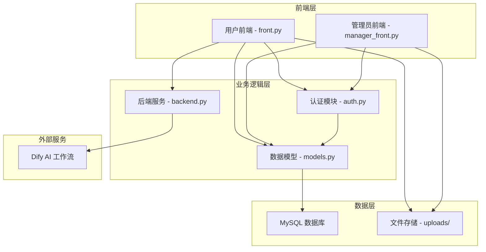
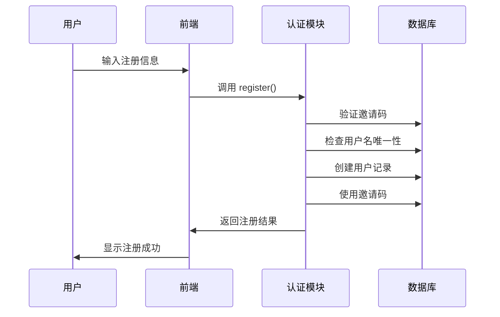
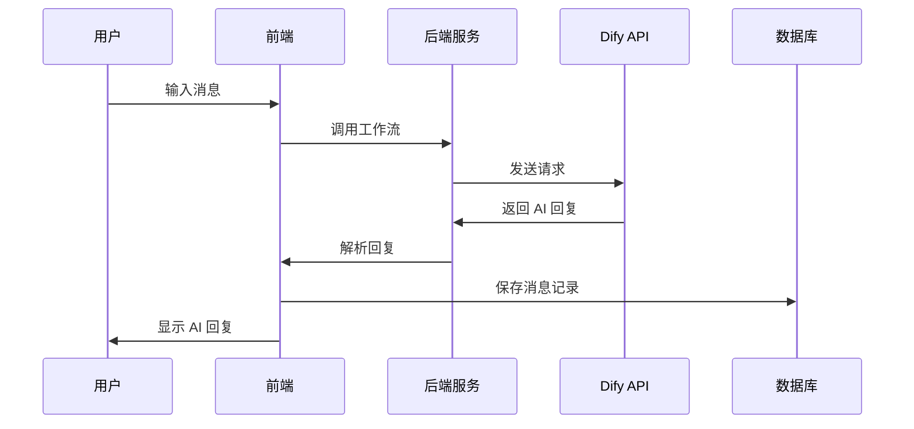
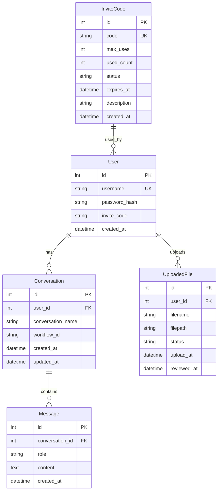

# ALMA AI 助手 - 项目架构设计文档

## 📋 项目概述

ALMA AI 助手是一个基于 Streamlit 的 Web 应用，集成了 Dify AI 工作流，提供用户聊天、文件上传、管理员后台等功能。项目采用前后端分离的架构设计，使用 SQLModel ORM 进行数据持久化。

## 🏗️ 整体架构



## 📁 项目结构

```
ALMA/
├── design/                          # 设计文档目录
│   └── 项目架构设计文档.md
├── web/                            # 核心代码目录
│   ├── front.py                    # 用户前端界面
│   ├── manager_front.py            # 管理员前端界面
│   ├── auth.py                     # 认证管理模块
│   ├── backend.py                  # Dify 后端服务
│   ├── models.py                   # 数据模型和数据库管理
│   ├── config.json                 # 配置文件
│   ├── start.py                    # 启动脚本
│   ├── init_database_sqlmodel.py   # 数据库初始化
│   └── requirements.txt            # 依赖包列表
└── README.md                       # 项目说明
```

## 🔧 核心模块详解

### 1. 数据模型层 (`models.py`)

**设计理念**：使用 SQLModel 实现最简化的 ORM，避免复杂的数据库操作。

#### 核心数据模型

```python
class User(SQLModel, table=True, extend_existing=True):
    """用户表"""
    id: Optional[int] = Field(default=None, primary_key=True)
    username: str = Field(unique=True, index=True, max_length=50)
    password_hash: str = Field(max_length=255)  # 存储明文密码
    invite_code: str = Field(max_length=20)
    created_at: datetime = Field(default_factory=datetime.now)

class Conversation(SQLModel, table=True, extend_existing=True):
    """对话表"""
    id: Optional[int] = Field(default=None, primary_key=True)
    user_id: int = Field(foreign_key="user.id")
    conversation_name: str = Field(max_length=100)
    workflow_id: str = Field(max_length=50)
    created_at: datetime = Field(default_factory=datetime.now)
    updated_at: datetime = Field(default_factory=datetime.now)

class Message(SQLModel, table=True, extend_existing=True):
    """消息表"""
    id: Optional[int] = Field(default=None, primary_key=True)
    conversation_id: int = Field(foreign_key="conversation.id")
    role: str = Field(max_length=20)  # user, assistant
    content: str = Field()
    created_at: datetime = Field(default_factory=datetime.now)
```

#### 数据库管理类

```python
class DatabaseManager:
    """基于 SQLModel 的数据库管理类"""
    
    def __init__(self, config_file: str = "config.json"):
        self.config = self.load_config()
        self.engine = self._init_engine()
    
    def create_user(self, username: str, password: str, invite_code: str) -> bool:
        """创建新用户 - 支持邀请码验证"""
        
    def save_conversation(self, user_id: int, conversation_name: str, workflow_id: str) -> Optional[int]:
        """保存对话记录"""
        
    def save_message(self, conversation_id: int, role: str, content: str) -> bool:
        """保存消息记录"""
```

**关键设计决策**：
- 使用 `extend_existing=True` 解决 Streamlit 重载导致的表重复定义问题
- 密码采用明文存储，简化认证逻辑
- 支持对话历史持久化和恢复

### 2. 认证模块 (`auth.py`)

**设计理念**：基于邀请码的注册 + 用户名密码登录模式。

#### 认证流程

```python
class AuthManager:
    """认证管理类 - 支持注册和登录"""
    
    def register(self, username: str, password: str, invite_code: str) -> tuple[bool, str]:
        """用户注册流程"""
        # 1. 验证邀请码有效性
        # 2. 检查用户名唯一性
        # 3. 创建用户记录
        # 4. 使用邀请码（增加使用次数）
    
    def login(self, username: str, password: str) -> bool:
        """用户登录流程"""
        # 1. 查询用户信息
        # 2. 验证密码（明文比较）
        # 3. 设置会话状态
```

#### 会话管理

```python
def require_auth(auth_manager: AuthManager) -> bool:
    """检查登录状态，未登录则显示登录页面"""
    if auth_manager.is_logged_in():
        return True
    else:
        auth_manager.show_login_page()
        return False
```

**关键设计决策**：
- 使用 Streamlit 的 `st.session_state` 管理用户会话
- 支持注册和登录的标签页切换
- 邀请码机制控制用户注册

### 3. 后端服务 (`backend.py`)

**设计理念**：封装 Dify API 调用，支持多工作流切换。

#### Dify 集成

```python
class DifyBackend:
    """Dify 后端连接管理类"""
    
    def run_dify_workflow_blocking(self, question: str, user_id: str, workflow_id: str) -> Dict:
        """调用 Dify 工作流（blocking 模式）"""
        url = f"{workflow_config['api_base']}/v1/workflows/run"
        headers = {
            "Authorization": workflow_config['api_key'],
            "Content-Type": "application/json",
        }
        payload = {
            "inputs": {"question": question},
            "response_mode": "blocking",
            "user": user_id,
        }
    
    def parse_dify_response(self, data: Dict) -> str:
        """解析 Dify 响应，兼容不同响应结构"""
        # 支持多种响应格式的解析
```

**关键设计决策**：
- 支持多个 Dify 工作流配置
- 兼容不同的 API 响应格式
- 提供工作流连接测试功能

### 4. 用户前端 (`front.py`)

**设计理念**：提供直观的聊天界面，支持对话管理、文件上传、工作流选择。

#### 核心功能模块

```python
# 1. 对话管理
def load_user_conversations():
    """加载用户对话历史"""
    
def create_new_conversation():
    """创建新对话"""
    
def save_conversation_to_db():
    """保存对话到数据库"""

# 2. 聊天界面
def render_chat_interface():
    """渲染聊天界面"""
    
def handle_user_input():
    """处理用户输入和 AI 回复"""

# 3. 文件上传
def handle_file_upload():
    """处理文件上传"""
    
def show_uploaded_files():
    """显示已上传文件列表"""
```

#### 工作流选择

```python
def show_workflow_selector():
    """显示工作流选择器"""
    workflows = get_workflow_list()
    selected_workflow = st.selectbox(
        "选择 AI 工作流",
        options=[w['id'] for w in workflows],
        format_func=lambda x: next(w['name'] for w in workflows if w['id'] == x)
    )
```

**关键设计决策**：
- 使用 Streamlit 的会话状态管理对话
- 支持对话重命名和删除
- 集成文件上传和审批流程

### 5. 管理员前端 (`manager_front.py`)

**设计理念**：提供完整的后台管理功能，包括文件审批、用户管理、邀请码管理等。

#### 管理功能模块

```python
# 1. 文件审批
def show_file_approval():
    """文件审批界面"""
    pending_files = db_manager.get_pending_files()
    for file in pending_files:
        # 显示文件信息和审批按钮
        if st.button(f"批准 {file.filename}"):
            db_manager.update_file_status(file.id, "approved")

# 2. 邀请码管理
def show_invite_code_management():
    """邀请码管理界面"""
    # 创建新邀请码
    # 查看邀请码使用情况
    # 禁用/启用邀请码

# 3. 工作流状态监控
def show_workflow_status():
    """工作流状态监控"""
    status = test_all_workflows()
    for workflow_id, info in status.items():
        # 显示工作流连接状态
```

**关键设计决策**：
- 模块化的管理界面设计
- 实时状态监控
- 批量操作支持

## 🔄 数据流程

### 用户注册流程



### 聊天对话流程



## ⚙️ 配置管理

### 数据库配置

```json
{
  "database": {
    "host": "101.34.214.7",
    "port": 3306,
    "database": "alma_db",
    "user": "root",
    "password": "wenhantop123",
    "connect_timeout": 30,
    "autocommit": true
  }
}
```

### Dify 工作流配置

```json
{
  "workflows": [
    {
      "id": "workflow_1",
      "name": "通用助手",
      "description": "适用于一般性问答和对话",
      "api_key": "Bearer app-F4F2QM3rjs8DZgTtpIitoxlx",
      "api_base": "http://ai.wenhan.top:8080"
    }
  ]
}
```

## 🚀 启动方式

### 1. 命令行启动

```bash
# 用户前端
python start.py -u

# 管理员前端
python start.py -m

# 同时启动两个前端
python start.py -u -m

# 初始化数据库
python start.py -i
```

### 2. 直接脚本启动

```bash
# 用户前端
python start_user.py

# 管理员前端
python start_manager.py

# 同时启动
python start_both.py
```

### 3. 数据库初始化

```bash
python init_database_sqlmodel.py
```

## 🔧 技术栈

- **前端框架**: Streamlit
- **数据库**: MySQL + SQLModel ORM
- **AI 服务**: Dify API
- **认证**: 邀请码 + 用户名密码
- **文件存储**: 本地文件系统
- **部署**: 支持多端口并发运行

## 📊 数据库设计

### 表关系图



## 🛡️ 安全设计

### 1. 认证安全
- 邀请码机制控制用户注册
- 用户名唯一性验证
- 会话状态管理

### 2. 数据安全
- 数据库连接池管理
- SQL 注入防护（SQLModel ORM）
- 文件上传路径验证

### 3. 访问控制
- 管理员密码保护
- 用户会话隔离
- 文件访问权限控制

## 🔍 关键代码分析

### 1. 数据库连接管理

```python
def _init_engine(self):
    """初始化数据库引擎"""
    database_url = (
        f"mysql+pymysql://{db_config['user']}:{db_config['password']}"
        f"@{db_config['host']}:{db_config['port']}/{db_config['database']}"
        f"?charset=utf8mb4"
    )
    
    self.engine = create_engine(
        database_url,
        echo=False,
        pool_pre_ping=True,  # 连接池预检查
        pool_recycle=3600,  # 连接回收时间
    )
```

**设计要点**：
- 使用连接池提高性能
- 自动重连机制
- 字符集统一为 utf8mb4

### 2. 会话状态管理

```python
def is_logged_in(self) -> bool:
    """检查用户是否已登录"""
    return "user_id" in st.session_state and "username" in st.session_state

def logout(self):
    """用户登出"""
    keys_to_remove = [
        "user_id", "username", "login_time", "conversations", 
        "current_conversation", "conversation_counter", "rename_mode",
        "user_avatar", "user_name"
    ]
    
    for key in keys_to_remove:
        if key in st.session_state:
            del st.session_state[key]
```

**设计要点**：
- 完整的会话状态清理
- 支持用户信息持久化
- 安全的登出机制

### 3. 多工作流支持

```python
def get_workflow_list(self) -> List[Dict]:
    """获取工作流列表"""
    return self.config.get('workflows', [])

def run_dify_workflow_blocking(self, question: str, user_id: str, workflow_id: str) -> Dict:
    """调用 Dify 工作流"""
    workflow_config = self.get_workflow_by_id(workflow_id)
    if not workflow_config:
        raise ValueError(f"工作流 {workflow_id} 不存在")
    
    url = f"{workflow_config['api_base']}/v1/workflows/run"
    headers = {
        "Authorization": workflow_config['api_key'],
        "Content-Type": "application/json",
    }
```

**设计要点**：
- 支持多个 Dify 工作流
- 动态工作流选择
- 统一的 API 调用接口

## 🚀 部署和运维

### 1. 环境要求
- Python 3.8+
- MySQL 5.7+
- 网络访问 Dify API

### 2. 安装步骤
```bash
# 1. 安装依赖
pip install -r requirements.txt

# 2. 配置数据库
# 修改 config.json 中的数据库配置

# 3. 初始化数据库
python init_database_sqlmodel.py

# 4. 启动应用
python start.py -u -m
```

### 3. 监控和维护
- 数据库连接状态监控
- 工作流连接测试
- 文件存储空间管理
- 用户会话管理

## 📈 扩展性设计

### 1. 水平扩展
- 支持多实例部署
- 数据库连接池优化
- 文件存储分离

### 2. 功能扩展
- 插件化工作流
- 自定义认证方式
- 多语言支持

### 3. 性能优化
- 缓存机制
- 异步处理
- 数据库索引优化

## 🎯 开发指南

### 1. 新功能开发
1. 在 `models.py` 中定义数据模型
2. 在 `auth.py` 中添加认证逻辑
3. 在 `backend.py` 中添加服务接口
4. 在前端界面中集成功能

### 2. 调试技巧
- 使用 `echo=True` 查看 SQL 语句
- 利用 Streamlit 的 `st.write()` 调试
- 检查数据库连接状态

### 3. 测试建议
- 单元测试覆盖核心逻辑
- 集成测试验证完整流程
- 性能测试确保并发能力

---

## 📝 总结

ALMA AI 助手采用模块化、可扩展的架构设计，通过 SQLModel ORM 简化数据库操作，使用 Streamlit 提供直观的用户界面，集成 Dify AI 工作流实现智能对话功能。项目支持多用户、多工作流、文件管理等完整功能，适合快速部署和二次开发。

**核心优势**：
- 🏗️ **模块化设计**：清晰的代码结构和职责分离
- 🔧 **简化实现**：使用 SQLModel 避免复杂的 SQL 操作
- 🚀 **快速部署**：支持一键启动和数据库初始化
- 🔒 **安全可靠**：邀请码机制和会话管理
- 📈 **易于扩展**：支持多工作流和功能插件化
